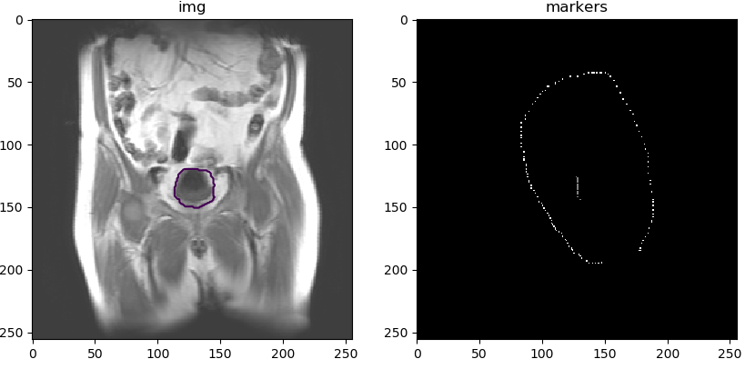

# random_walker_gui
a interactive demo for random_walker algorithm

the code is originate from https://github.com/emmanuelle/random_walker

## useage

1. run main_gui.py

    `>>> python main_gui.py`

2. mark foreground and background points respectively, press `ESC` to finish.

    

3. then wait for the segmentation result.
   
   